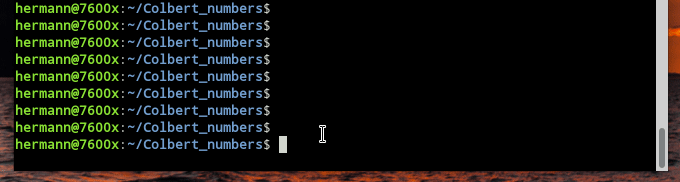

A Colbert number (https://oeis.org/A258074) is an integer with more than 1,000,000 digits that is prime and has contributed to the in-progress computational proof that 78557 is the smallest Sierpiński number. 

[Colbert.py](Colbert.py) contains entries [k,n,s,x,y] for the 6 Colbert numbers. Because the numbers are huge, that file is 35MB in size. For Colbert prime *p=k\*2^n+1*, *s^2 % p == p-1* and *p == x^2 + y^2*.  
[After having computed *sqrt(-1) (mod p)* for biggest 9,383,761-digit Colbert number in 10:45:01h [with patched LLR software](https://github.com/Hermann-SW/9383761-digit-prime#fast-sqrt-1-mod-p-for-9383761-digit-prime-p-1-mod-4), the other numbers were processed as well. Sum of suqares was easy to determine in few seconds from *sqrtm1 = sqrt(-1) (mod p)* with PARI/GP "halfgcd(sqrtm1, p)"]

File extension is ".py" so that Python can import it, but it can be read from PARI/GP with "\r Colbert.py" as well.

Since "mpz_class(...)" is not part of Colbert.py, C++ needs to read line by line, remove trailing ",\\" or only "\\" and then pass that to "mpz_class(...)".  

Same validation takes different amount of code in the three languages:  
```
hermann@7600x:~/Colbert_numbers$ wc --lines validate.*
  66 validate.cc
   9 validate.gp
  19 validate.py
  94 total
hermann@7600x:~/Colbert_numbers$ 
```

This is PARI/GP script validate.gp:
```
\r Colbert.py
assert(b) = { if(!(b), error("assertion failed")); }
print("6 entries of the form [k,n,s,x,y], with p=k*2^n+1, s^2%p==p-1 and p==x^2+y^2");
foreach(C,v,p=v[1]*2^v[2]+1;\
  printf("%18s (%d-digit prime)\n",Str(v[1],"*2^",v[2],"+1"),#digits(p));\
  assert(v[3]^2%p==p-1);\
  assert(v[4]^2+v[5]^2==p);\
);
print("done, all asserts OK");
```

Here is validation done for all three languages:  

